# Forest-Pals

 

 

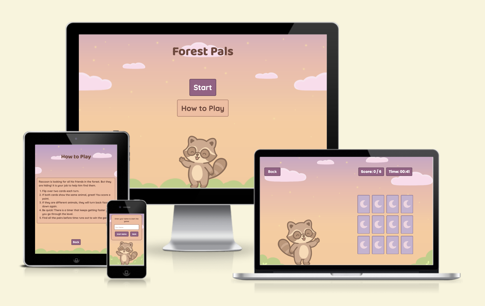

[Link to Live Website](https://carokyp.github.io/Forest-Pals/)

## About 

**Forest Pals** is an interactive memory card game designed primarily for young children to learn about forest animals in a fun and engaging way. Players match pairs of adorable woodland creatures including birds, deer, foxes, hedgehogs, rabbits, and squirrels, helping them recognize and remember different animal names.

The game features a friendly raccoon mascot who encourages players throughout their journey with cheerful messages and congratulations when they find matching pairs. With its colorful design, simple controls, and timed gameplay, Forest Pals makes learning entertaining.

Currently, the game is ideal for younger children who are discovering animals and developing memory skills. However, with planned future features like difficulty levels, special card mechanics, and competitive elements, Forest Pals has the potential to evolve into a more comprehensive game suitable for older children and adults who enjoy fun, challenging memory games beyond just educational content.

## Index – Table of Contents
* [User Experience (UX)](#user-experience-ux)
   * [Strategy](#strategy)
   * [Scope](#scope)
   * [Structure](#structure)
   * [Skeleton](#skeleton)
   * [Surface](#surface)

* [Features](#features)
* [Technologies Used](#technologies-used)
* [Testing](#testing)
* [Deployment](#deployment)
* [Credits](#credits)

## User Experience (UX)

### Strategy

Forest Pals is designed for young children, parents and educators seeking an engaging and educational memory game that teaches animal recognition while developing cognitive skills. The game provides a safe, accessible, and fun learning environment, allowing children to play at home or on the go. Forest Pals creates an entertaining way for children to learn about forest animals while improving their memory and concentration abilities.

#### Business goals of the website are:

- Create an engaging educational game that helps young children learn about forest animals
- Provide a fun, accessible memory game that works on all devices
- Help children develop and improve their memory and concentration skills through gameplay
- Build a foundation for future feature expansion and competitive gameplay options

#### The customer goals of this website are:

- Find an educational game that helps children learn animal names in a fun way
- Access a simple, easy-to-understand game suitable for young children
- Play a memory game that provides immediate feedback and encouragement
- Track progress through a highscore system

#### User stories

- As a **parent**, I want to find a safe educational game for my child, so that they can learn about animals in a fun and engaging way.

- As a **player**, I want to see my name in the game, so that it feels special and personal to me.

- As a **player**, I want easy navigation and clear "How to Play" instructions, so that I can understand the game quickly without frustration.

- As a **player**, I want to see a highscore leaderboard with my fastest times, so that I can challenge myself to improve and compete with family members.

- As a **player**, I want my highscores to be saved, so that I can see my progress and try to beat my previous best times.

- As a **user**, I want the game to be responsive and touch-friendly, so that I can play comfortably on my phone, tablet or desktop.

### Scope

#### In scope Features:

1. **Main Menu Navigation**
   - Start game button
   - How to Play instructions
   - Raccoon mascot character

2. **Player Name System**
   - Player name input with validation
   - Name persistence during game session
   - Personalized messages using player name when game is complete

3. **Memory Card Game**
   - 12 cards (6 pairs of forest animals)
   - Card flip animations
   - Match detection logic
   - Shuffled card layout (Fisher-Yates algorithm)

4. **Game Timer**
   - Real-time timer in mm:ss format
   - Automatic start when game begins
   - Stops when game completes

5. **Score Tracking**
   - Live score display (X / 6 pairs)
   - Updates on each successful match

6. **Raccoon Speech Bubbles**
   - Congratulatory messages for each animal match
   - Two random messages per animal match
   - Final completion message with player name

7. **Highscores System**
   - Top 5 fastest times
   - Sorted by completion time
   - Persistent storage using localStorage
   - Highlighted new scores

8. **End Screen**
   - Player name and final time display
   - Highscores leaderboard
   - Retry button (preserves player name)
   - Main menu button (resets game)

9. **Responsive Design**
   - Adaptive card grid layout (4x3 on large screens, 3x4 on small)
   - Mobile-friendly interface
   - Conditional raccoon mascot visibility

10. **Game Controls**
    - Back button in game HUD
    - Form validation
    - Board locking during card evaluation

#### Out of scope Features:

1. **Difficulty Levels** - Easy/Medium/Hard modes that would increase the challenge by:
   - Adding more card pairs to the game board (e.g., 12 cards for Easy, 20 for Medium, 30+ for Hard)
   - Using more visually similar animal images to make matching harder (e.g., different shades of the same animal)
   - Restricting the number of moves allowed to complete the game (e.g., 20 moves for Easy, 15 for Medium, 10 for Hard)
   - **Special Card Mechanics:**
     - Trap/Penalty cards that increase the timer when flipped or add more cards onto the player's game board (making it harder to achieve a fast time and complete the game)
     - Bonus cards that briefly reveal all cards on the grid for a few seconds, or decrease the timer to help players achieve a better score and climb the leaderboard
   
2. **Sound Effects & Music** - Audio feedback to enhance the gaming experience and immersion:
   - Card flip sounds when players click and reveal cards
   - Success sound effects for matches (actual animal sounds)
   - Failure sound effects when cards don't match
   - Background music during gameplay (soft melodies)
   - Raccoon character voice lines or sounds when delivering messages
   
3. **Themes/Skins** - Customizable visual appearance to personalize the game:
   - Different card designs based on themes: seasons (spring flowers, autumn leaves), countries (wildlife from different regions), or other animal sets (ocean creatures, farm animals)
   - Alternative background images or color schemes to match the selected theme
   - Ability to unlock themes by completing challenges or achieving high scores
   
4. **Pause Button** - Game control feature to allow players to take breaks:
   - Ability to pause the timer mid-game without losing progress
   - Resume from the exact game state (all flipped cards remain in their current state)
   - Pause menu with options to resume the current game, restart, or return to the main menu
   
5. **Settings Menu** - Player preferences and customization options:
   - Toggle sound effects and background music on/off
   - Adjust difficulty level without starting a new game
   - Select preferred card deck themes from unlocked options
   - Option to clear localStorage (reset highscores)

### Structure

Forest Pals uses a **single-page application (SPA)** structure where all content exists on one HTML page (`index.html`). JavaScript dynamically shows and hides different sections to create a smooth, seamless user experience without page reloads. This approach improves performance by eliminating loading times between screens and provides instant transitions.

The game follows a **state-based navigation** model with five distinct screens that users can navigate between:

#### Game States & Navigation Flow

**1. Main Menu**
- Starting screen displayed on page load
- Two primary actions: "Start" or "How to Play"
- Navigation options:
  - "Start" → Player Name Form
  - "How to Play" → Instructions Screen

**2. Instructions Screen**
- Displays game rules and how to play
- Navigation options:
  - "Back" → Main Menu

**3. Player Name Form**
- Requires player name input with validation
- Navigation options:
  - "Start Game" → Active Game (if valid name entered)
  - "Back" → Main Menu

**4. Active Game**
- Main gameplay area with 12 cards, timer, and score
- Raccoon mascot provides encouragement (visible on screens wider than 768px)
- Navigation options:
  - "Back" → Main Menu (abandons current game)
  - Automatic transition → End Screen (when all 6 pairs matched)

**5. End Screen**
- Displays completion message, time, and highscores leaderboard
- Navigation options:
  - "Retry" → Active Game (preserves player name, resets board)
  - "Main Menu" → Main Menu (resets player session)

#### Technical Implementation

- **State Management:** Only one screen is visible at a time (controlled by CSS `display` properties)
- **Transitions:** JavaScript functions handle instant screen switching without page reloads
- **Data Persistence:** localStorage saves highscores across browser sessions
- **User Experience:** Prevents page scrolling and element dragging for distraction-free gameplay

### Skeleton

During this phase, wireframes for all game states were created using [Balsamiq](https://balsamiq.com/) to visualize the user journey and interface layout.

### Wireframes

The design prioritizes responsive functionality across all device types, utilizing [CSS Grid](https://developer.mozilla.org/en-US/docs/Web/CSS/CSS_grid_layout) for flexible card layouts with carefully crafted breakpoints ensuring optimal layouts and user experience:

- **Mobile (up to 480px):** Compact 3x4 card grid, streamlined interface, hidden mascot during gameplay
- **Small tablets (481px - 767px):** Enhanced spacing, adjusted typography for readability
- **Tablets (768px - 1023px):** Visible raccoon mascot, 4x3 card grid, improved visual hierarchy
- **Laptops (1024px - 1439px):** Expanded layout with balanced proportions
- **Large displays (1440px+):** Maximum 1800px content width for optimal viewing experience

This responsive architecture ensures seamless gameplay and visual clarity whether players are on mobile phones, tablets, or desktop computers.

Wireframes were created for each of the five game states to map out the user experience and interface design:

* **State 1: Main Menu**
  

  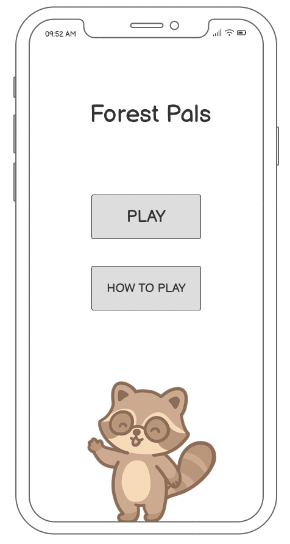
  
  
  

* **State 2: Instructions Screen**
  

  
  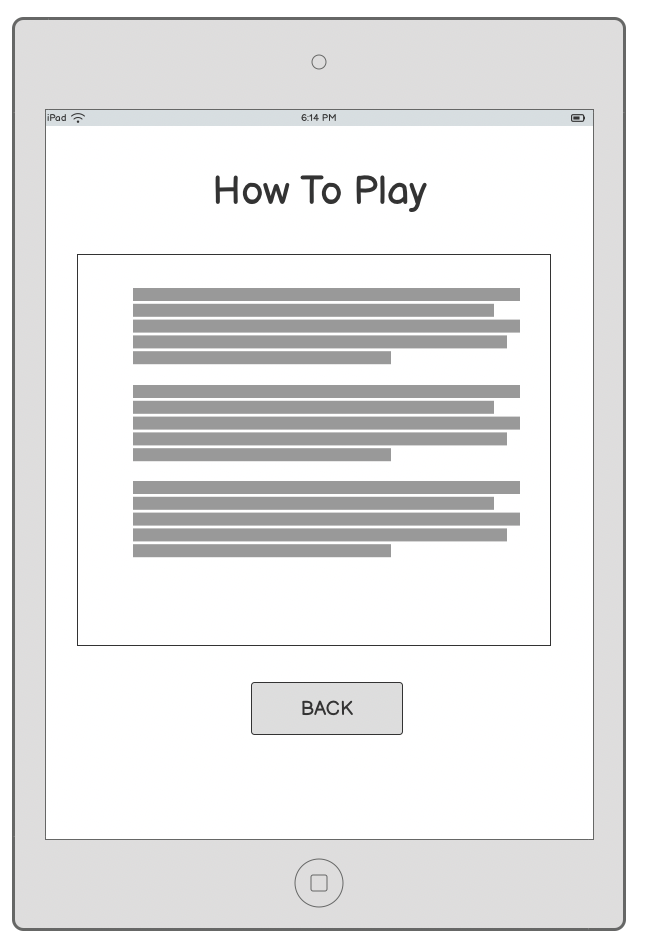
  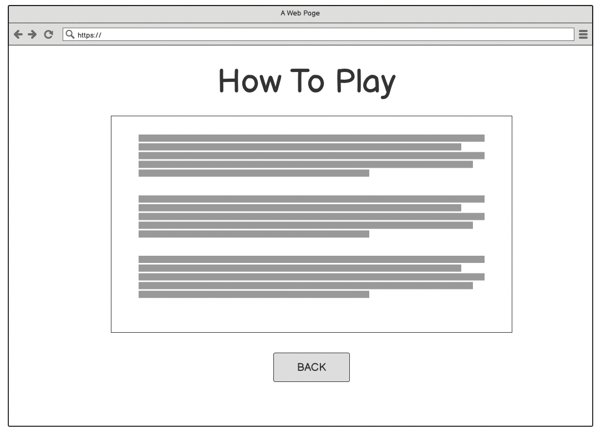
  

* **State 3: Player Name Form**
  

  
  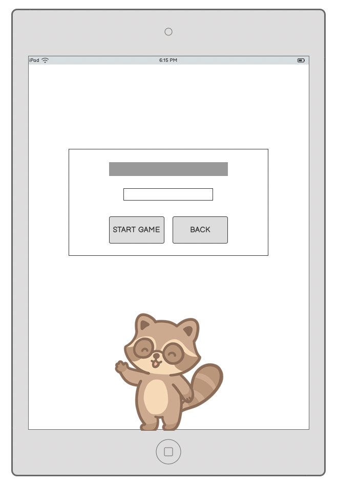
  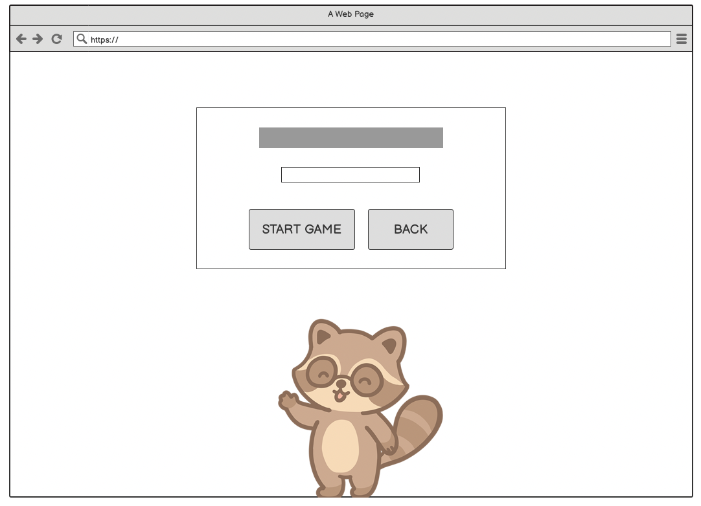
  

* **State 4: Active Game**
  

  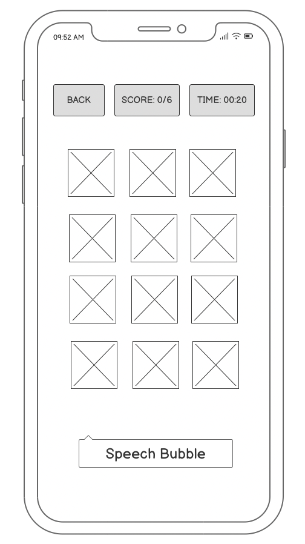
  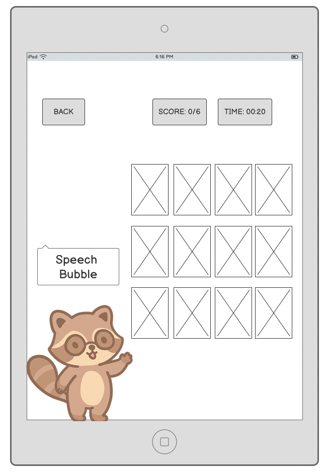
  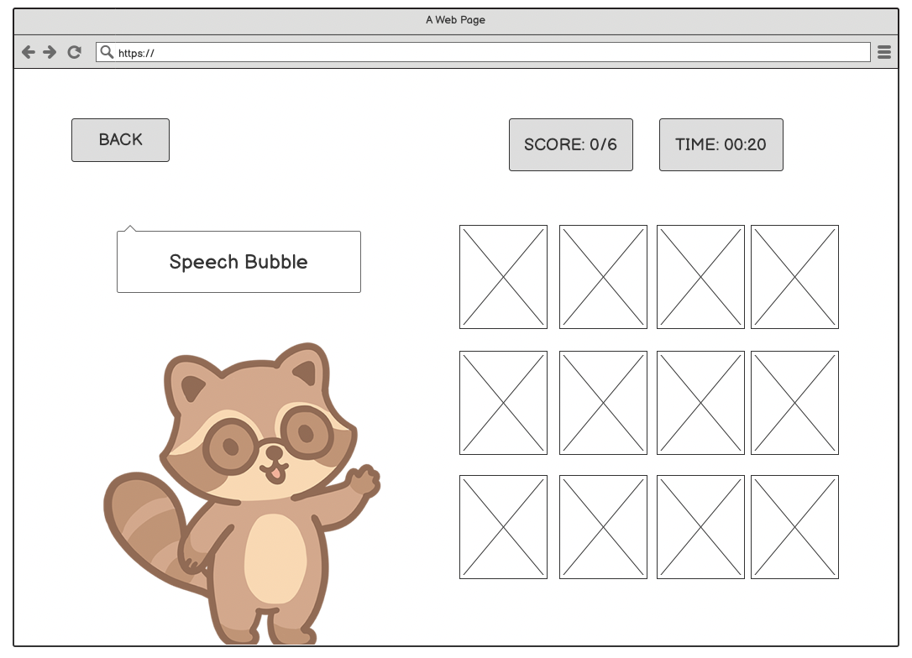
  

* **State 5: End Screen**
  

  
  
  
  

### Surface

#### Visual Style

Forest Pals features a **playful, child-friendly design** with a warm, woodland aesthetic that appeals to young children while maintaining clear readability and intuitive navigation. All visual assets including the forest background, animal card illustrations, and raccoon mascot were custom-designed and created in [Photoshop](https://www.adobe.com/uk/products/photoshop.html).

**Design:**
- Bright, inviting colors create a cheerful atmosphere suitable for children
- Rounded shapes and soft edges throughout the interface promote a gentle, non-threatening aesthetic
- Large, clear typography ensures readability for early readers
- Whimsical forest background creates an immersive woodland environment
- Custom illustrations designed specifically for the game ensure a cohesive, original visual identity

**Typography:**
- **Headings:** [Baloo 2](https://fonts.google.com/specimen/Baloo+2) - A playful, rounded cursive font perfect for children's content
  - Used for game title, section headers, and buttons
  - Fluid sizing (clamp) ensures readability across all devices
- **Body Text:** [Quicksand](https://fonts.google.com/specimen/Quicksand) - A friendly, geometric sans-serif
  - Used for instructions, game text, and UI elements
  - Clean and legible for young readers

#### Colors 

  

## Features

#### **Main Menu**

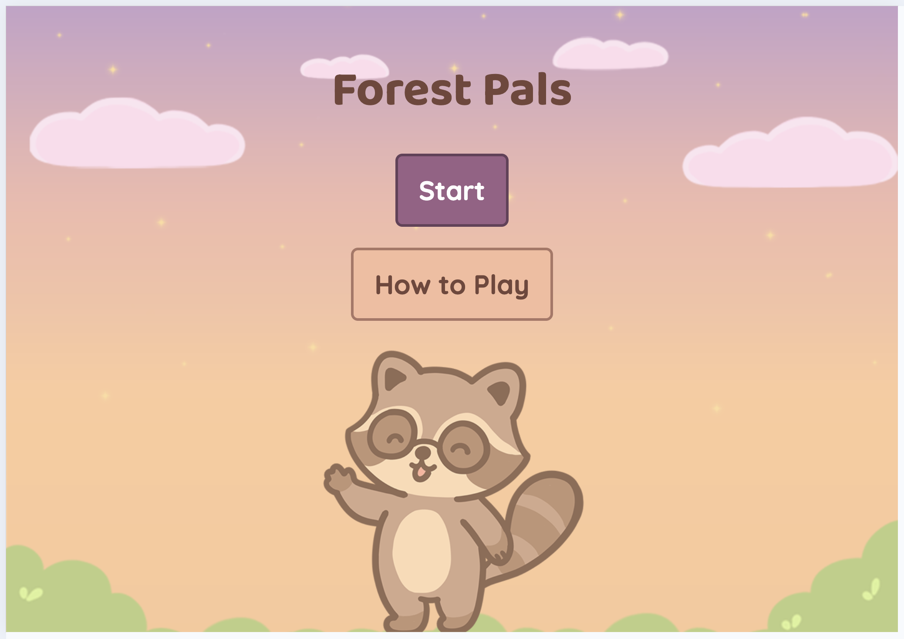

- Clean, welcoming interface with the game title and raccoon mascot
- "Start" button to begin a new game
- "How to Play" button that displays clear instructions for new players
- Easy navigation with back buttons to return to the main menu at any time

#### **Player Name System**

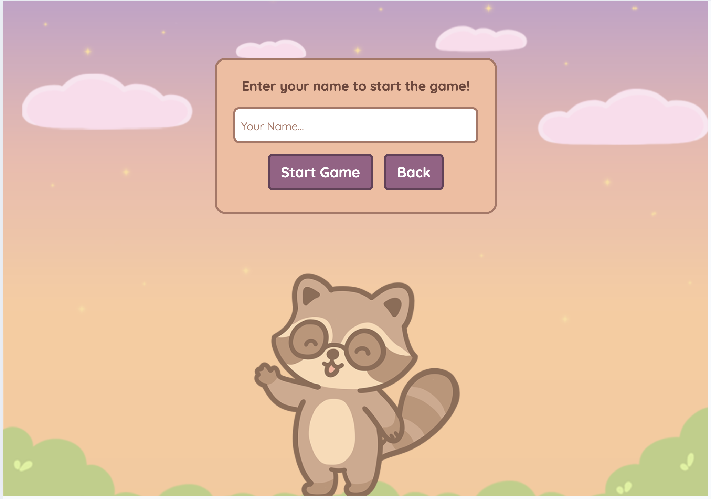

- Personalized experience with player name input
- Form validation ensures players enter a name before starting

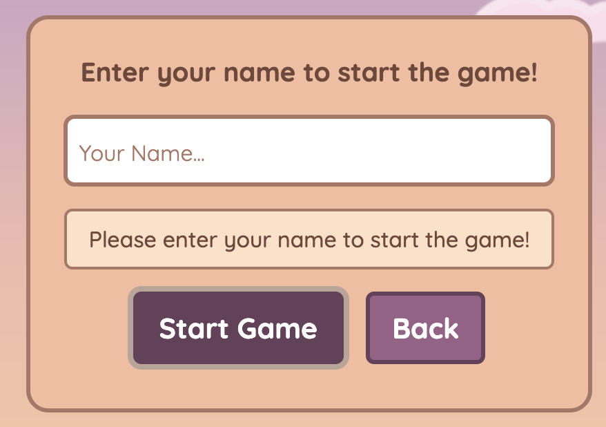

- Player name is displayed throughout the game and on the end screen
- Name persists during retry but resets when returning to the main menu

#### **Memory Card Game**

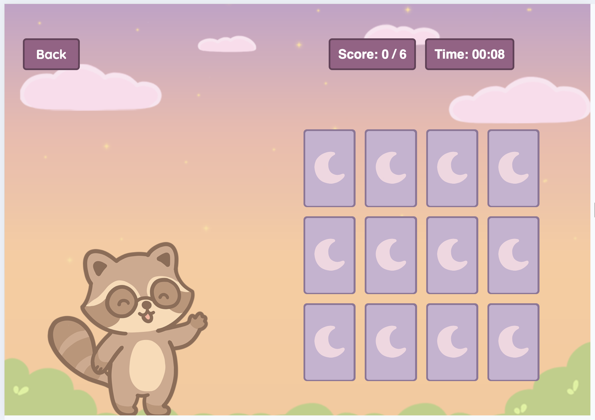

- 12 cards featuring 6 pairs of adorable forest animals (birds, deer, foxes, hedgehogs, rabbits, squirrels)
- Smooth card flip animations for engaging gameplay
- Shuffled card layout using Fisher-Yates algorithm ensures a unique game every time
- Responsive grid layout adapts to screen size (4x3 on large screens, 3x4 on small screens)

#### **Game Timer & Score Tracking**
- Real-time timer displays in mm:ss format
- Timer automatically starts when the game begins and stops when completed
- Live score display showing pairs matched out of 6
- Players compete for the fastest completion time

#### **Raccoon Character & Speech Bubbles**

- Friendly raccoon mascot provides encouragement throughout the game
- Animal-specific congratulatory messages when matching pairs
- Two different random messages for each animal type
- Special completion message with player's name when all pairs are found
- Speech bubbles automatically disappear after a few seconds

#### **Highscores Leaderboard**

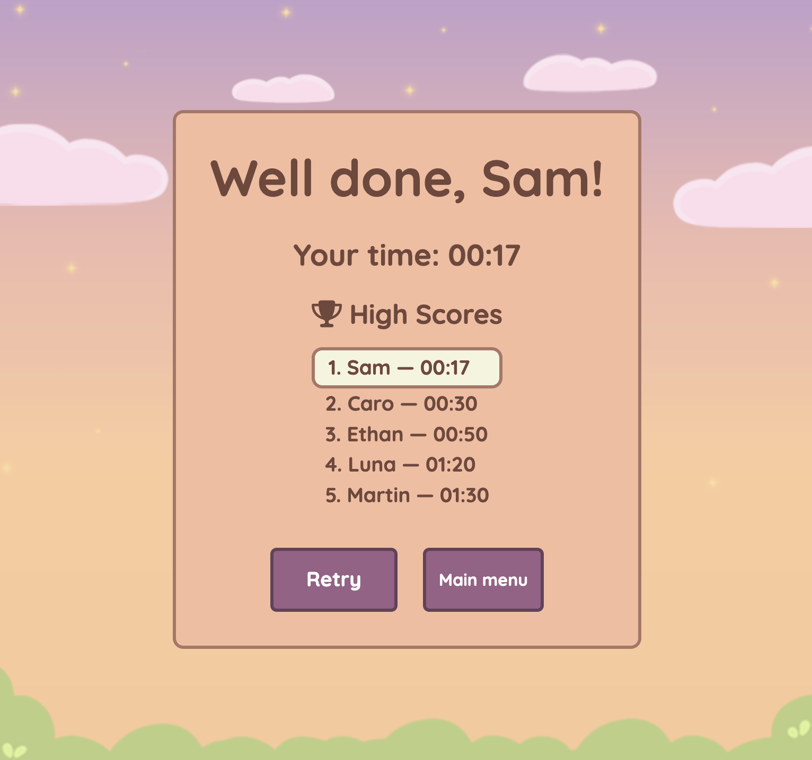

- Top 5 fastest completion times are saved and displayed
- Scores persist using browser localStorage (survives browser restarts)
- New scores are automatically sorted by completion time
- Latest score is highlighted for easy identification
- Leaderboard displays on the end screen after each game completion

#### **End Screen**
- Congratulatory message with player's name
- Display of completion time
- Full highscores leaderboard
- "Retry" button to play again with the same name
- "Main Menu" button to start fresh with a new player

#### **Responsive Design**
- Mobile-friendly interface tested on iPhone SE, iPhone XR, iPhone 12 Pro, iPhone 14 Pro Max, Pixel 7, and Samsung Galaxy S8+, as well as similar-sized devices
- Adaptive card grid layout for optimal viewing (4x3 on screens wider than 480px, 3x4 on smaller screens)
- Raccoon mascot visibility adjusts based on screen size (visible on screens wider than 768px, hidden in game view on smaller screens)
- Speech bubble positioning optimized for mobile devices
- Touch-friendly controls for mobile gameplay

#### **User Experience Enhancements**
- Board locking prevents accidental clicks during card evaluation
- Form validation with helpful error messages
- Prevents page scrolling and element dragging for distraction-free gameplay
- Only one game section visible at a time for clarity
- Smooth transitions between game states

### Future Features

- **Difficulty Levels** - Easy, Medium, and Hard modes with more cards, special trap/bonus cards, and move limits
- **Sound Effects & Music** - Audio feedback for card flips, matches, and background music with optional raccoon voice lines
- **Themes & Customization** - Seasonal and geographic themes with unlockable card designs and backgrounds
- **Pause Functionality** - Pause button to stop the timer and resume from the exact game state
- **Settings Menu** - Control sound, difficulty, themes, and ability to reset highscores

## Technologies Used

__Languages Used__

* [HTML5](https://en.wikipedia.org/wiki/HTML5)
* [CSS](https://en.wikipedia.org/wiki/CSS)
* [JavaScript](https://en.wikipedia.org/wiki/JavaScript)
  
__Frameworks, Libraries & Programs Used__

* [Bootstrap 5](https://getbootstrap.com/docs/5.3/getting-started/introduction/): was used for responsive layout, button styling, and utility classes
* [Google Fonts](https://fonts.google.com/): was used to import the 'Baloo 2' and 'Quicksand' fonts into the style.css 
* [Font Awesome](https://fontawesome.com/): was used to add icons for aesthetic and UX purposes.
* [GitHub](https://github.com/): is used as the repository for the project's code after being pushed from Git.
* [Photoshop](https://www.adobe.com/uk/products/photoshop.html): was used for early design to help get a better idea of which colors and images would suit the website. It was also used to resize and edit pictures, as well as create the menus and color palette
* [Visual Studio Git Source Control](https://learn.microsoft.com/en-us/visualstudio/version-control/git-with-visual-studio?view=vs-2022): was used to commit and push or pull changes to GitHub 
* [Balsamiq](https://balsamiq.com/): was used to create the wireframes during the design process.
* [ChatGPT](https://openai.com/chatgpt): was used to assist with grammar correction, code structure improvements, and README documentation organization
* [Copilot in VS Code](https://code.visualstudio.com/docs/copilot/overview): was used to help with code completion, debugging, and suggesting best practices for JavaScript implementation
* [WAVE](https://wave.webaim.org/) & [Lighthouse](https://developer.chrome.com/docs/lighthouse): Used for accessibility testing to ensure that all content is readable and accessible to every user.
* [HTML Validator](https://validator.w3.org/#validate_by_input): Confirmed the HTML code is valid, with no errors detected.
* [CSS Validator](https://jigsaw.w3.org/css-validator/#validate_by_input): Verified the CSS code, with no errors detected.
* [JS-Beautify](https://beautifier.io/): Checked the formatting and structure of the HTML and CSS for consistency and readability.

## Testing 

### Validator Testing 

Testing has been carried out on the following browsers:

- **Google Chrome** - Version 139.0.7258.67
- **Firefox** - Version 141.0.3
- **Microsoft Edge** - Version 139.0.3405.86
- **Safari on macOS** - Version 26.0, Copyright © 2003-2025 Apple Inc.

#### Safari-Specific Issues Resolved:

During cross-browser testing, several Safari-specific rendering issues were identified and resolved to ensure consistent gameplay across all browsers.

| Issue | Cause | Solution | Status |
|-------|-------|----------|--------|
| Grid shifting left on load | Missing `-webkit-transform-style` prefix for 3D transforms | Added `-webkit-transform-style: preserve-3d` to card elements in `styles.css` | Fixed |
| Text/card selection enabled | Missing `-webkit-user-select` prefix | Added `-webkit-user-select: none` globally in `styles.css` | Fixed |

**Technical Details:**
- Safari requires vendor-prefixed properties for certain CSS features to work properly
- The 3D card flip animations use `transform-style: preserve-3d`, which needs the `-webkit-` prefix in Safari, without these prefixes Safari would recalculate element positions multiple times on page load, causing visual glitches
- Text selection prevention also requires the `-webkit-user-select` property in Safari to prevent players from highlighting cards and text during gameplay

[**HTML Validator**](https://validator.w3.org/)

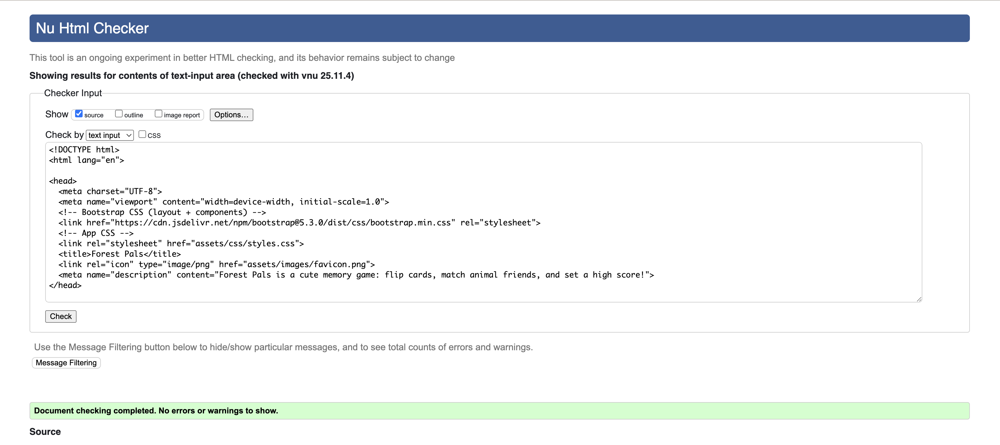

Click here to view full HTML validation results

  

[**CSS Validator**](https://jigsaw.w3.org/css-validator/)

#### CSS Warnings

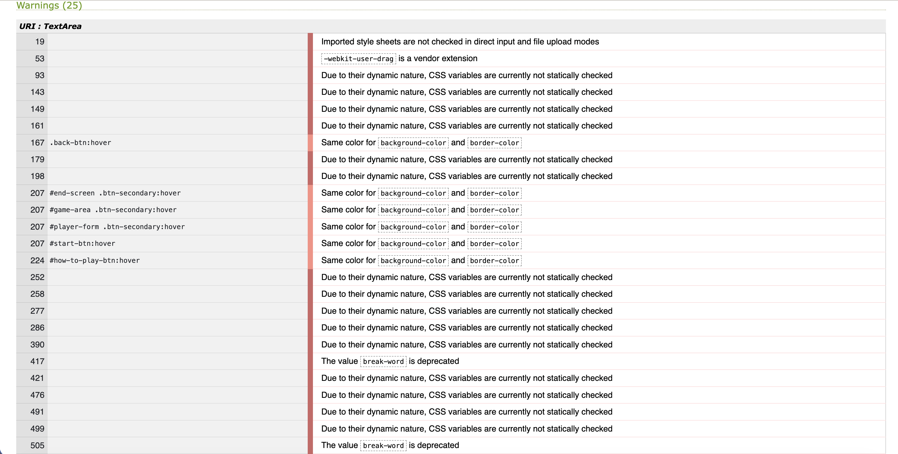

## CSS Validation Warnings — Summary and Explanation

When validating the stylesheet, several warnings were reported.  
These are **not errors** and do not affect the functionality of the website, they are mostly informational messages from the CSS validator.

| **Warning Type** | **Explanation** | **Resolution** |
|------------------|-----------------|----------------|
| Imported style sheets not checked | The validator cannot access or verify styles imported with `@import`. | No action required; this is normal behaviour. |
| Vendor extension (`-webkit-user-drag`) | This property is specific to WebKit browsers (e.g. Safari, Chrome) and is not part of the CSS standard. | Safe to keep for browser compatibility. |
| Dynamic CSS variables not statically checked | The validator cannot evaluate `var(--variable)` values because they depend on runtime definitions. | No action required; modern CSS practice. |
| Same color for background and border | The hover states use the same color for both `background-color` and `border-color`, which may reduce visual contrast. | Optional adjustment for better contrast. |
| Deprecated value `break-word` | The property `word-break: break-word;` is deprecated. | Replace with `overflow-wrap: break-word;` for modern syntax. |

**Summary:**  
All warnings are minor and expected when using modern CSS features such as custom properties and browser-specific extensions.  
The code remains fully functional and visually consistent across browsers.

[**JavaScript Validator**](https://jshint.com/)

The JavaScript code was validated using JSHint with no errors detected. The code follows best practices and maintains clean, readable syntax throughout.

## Functionality Testing

| Test Label | Test Action | Expected Outcome | Test Outcome | Notes |
|------------|-------------|------------------|--------------|-------|
| **MAIN MENU** |
| Main menu display | Load the game page | Main menu displays with "Forest Pals" title, "Start" button, "How to Play" button, and raccoon mascot image | PASS | |
| Start button functionality | Click on the "Start" button | Title and menu buttons hide, player form appears with name input field, "Start Game" button, "Back" button, and raccoon mascot | PASS | |
| How to Play button | Click on the "How to Play" button | "How to Play" screen displays with game instructions (5 numbered steps) and "Back" button | PASS | |
| Back button from How to Play | Click "Back" button on How to Play screen | Returns to main menu with all elements visible | PASS | |
| **PLAYER NAME FORM** |
| Player form display | Click "Start" from main menu | Form appears with instruction text, name input field, "Start Game" and "Back" buttons | PASS| |
| Empty name submission | Leave name field empty and click "Start Game" | Error message appears: "Please enter your name to start the game!" in a styled message box | PASS | |
| Valid name submission | Enter a name (e.g., "Alex") and click "Start Game" | Game area displays with HUD (score, timer, back button), 12 cards face down in grid | PASS |
| Back button from player form | Click "Back" button on player form | Returns to main menu, form is removed, all menu elements visible | PASS | |
| **GAME BOARD** |
| Game board generation | Submit valid player name | 12 cards (6 pairs) are displayed face down in a grid layout with gray backs | PASS | |
| Cards shuffled | Start game multiple times | Cards appear in different positions each time (shuffled using Fisher-Yates algorithm) | PASS | |
| HUD display | Game board loads | Top HUD shows: "Back" button (left), "Score: 0 / 6" and "Time: 00:00" (right) | PASS | |
| Timer starts automatically | Game board loads | Timer starts counting from 00:00 in mm:ss format, incrementing every second | PASS | |
| **CARD FLIPPING** |
| First card flip | Click on any face-down card | Card flips to reveal animal image| PASS | |
| Second card flip | Click on a second face-down card | Second card flips to reveal its animal image | PASS | |
| Third card blocked | Click on three cards rapidly | First two cards flip, third click is ignored (board is locked) | PASS | |
| Same card double-click | Click the same card twice | Second click is ignored, card stays flipped | PASS | |
| **MATCHING LOGIC** |
| Successful match | Flip two cards with the same animal | Cards remain face up, score increases by 1, speech bubble appears with congratulatory message specific to the animal | PASS | |
| Match score update | Match two cards | Score display updates to "Score: 1 / 6" (or appropriate number) | PASS | |
| Matched cards stay visible | Match two cards and continue playing | Matched cards remain face up and cannot be clicked again | PASS | |
| Raccoon speech variety | Match same animal type multiple times across games | Different congratulatory messages appear for the same animal (e.g., birds have 2 different messages) |PASS | |
| Failed match | Flip two cards with different animals | After a small delay, both cards flip back face down | PASS | |
| Board lock during mismatch | Flip two non-matching cards | Board is locked during the flip-back animation, preventing new clicks | PASS | |
| Board unlock after mismatch | Wait for non-matching cards to flip back | Board unlocks and new cards can be clicked | PASS | |
| **TIMER** |
| Timer format | Observe timer during gameplay | Timer displays as mm:ss (e.g., 00:05, 01:23) with leading zeros | PASS | |
| Timer increments | Play game for 65+ seconds | Timer correctly displays minutes and seconds (e.g., 01:05) | PASS | |
| Timer stops on completion | Match all 6 pairs | Timer stops counting when game is complete | PASS| |
| **GAME COMPLETION** |
| All pairs matched | Match all 6 pairs (score reaches 6/6) | Final speech bubble appears with personalized message: "You did it, [Player-Name]! You found all my friends!" | PASS | |
| End screen display | Complete the game (after 2-second delay) | End screen shows with: title "Well done, [Player-Name]!", player's final time, highscores list, "Retry" and "Main menu" buttons | PASS| |
| Player name on end screen | Complete game as "Alex" | End screen title shows "Well done, Alex!" | PASS | |
| Final time display | Complete game | Player's completion time is displayed in mm:ss format | PASS| |
| **HIGHSCORES** |
| Highscores list | Complete the game | Highscores list shows top 5 scores sorted by time (fastest first) | PASS| |
| New score added | Complete game with time not in top 5 | If score is in top 5, it's added and displayed; otherwise top 5 remains unchanged | PASS| |
| New top score | Complete game faster than all existing scores | New score appears at position 1, highlighted with special styling | PASS | |
| Score highlighting | Complete game with qualifying time | New score entry has "highlight" class applied for visual distinction |PASS | |
| Highscores persistence | Complete game, close browser, reopen | Highscores persist via localStorage and display on subsequent game completions | PASS | Scores persist until browser cache is cleared |
| Maximum 5 scores | Complete game 6+ times | Only top 5 fastest times are kept and displayed | PASS| |
| **END SCREEN BUTTONS** |
| Retry button | Click "Retry" button on end screen | Returns to game area with reset board (new shuffled cards), score at 0/6, timer at 00:00 |PASS | |
| Retry preserves player name | Click "Retry" | Player name is preserved, no need to re-enter name |PASS| |
| Main menu button | Click "Main menu" button on end screen | Returns to main menu, player name is reset (must enter name again for new game) |PASS| |
| Main menu full reset | Return to main menu from end screen | All elements visible (title, Start button, How to Play button, raccoon) | PASS| |
| **BACK BUTTON IN GAME** |
| Back button during game | Click "Back" button in top HUD while playing | Returns to main menu (timer stops, game is abandoned) | PASS | |
| **RESPONSIVE ELEMENTS** |
| Card grid layout - Large screens | View game on screens wider than 480px | Cards display in 4 columns x 3 rows grid layout | PASS | |
| Card grid layout - Small screens | View game on screens smaller than 480px | Cards display in 3 columns x 4 rows grid layout |PASS | |
| Raccoon mascot - Large screens | Game view on screens wider than 768px | Raccoon mascot image is visible on menu / form / game area | PASS| |
| Raccoon mascot - Small screens | Visible in Menu / form view on screens hidden in game view smaller than 768px | Raccoon mascot is hidden in the game view| PASS | |
| Speech bubble - Small screens | Match cards on screens smaller than 768px | Speech bubble appears at bottom of screen | PASS | |
| All images load | Load game and navigate through all screens | All images load correctly: card backs, card fronts (6 animals), raccoon mascot, background | PASS| |
| **ACCESSIBILITY & UX** |
| Prevent scrolling | Attempt to scroll page during game | Page doesn't scroll (overflow hidden on body) | PASS | |
| Prevent dragging | Try to drag elements | Elements cannot be dragged (dragstart prevented) | PASS| On Safari browser cards can be selected which highlight them in light blue color but won't be dragged or moved |
| Sections properly hidden | Navigate between sections | Only one section is visible at a time | PASS | |
| Speech bubble timeout | Match cards and wait | Speech bubble automatically disappears after 3 seconds | PASS | |

### Performance

Performance testing was conducted using [Google Lighthouse](https://developer.chrome.com/docs/lighthouse) to ensure optimal loading times, accessibility, and best practices across both desktop and mobile devices.

#### Desktop Performance

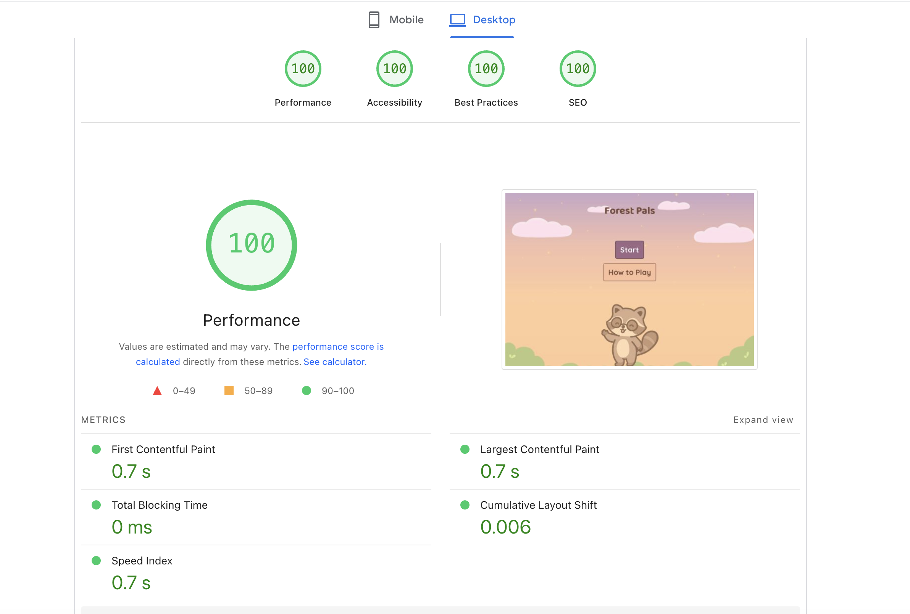

The desktop version achieved excellent scores across all metrics:
- **Performance:** 99/100 - Near perfect loading speed and responsiveness
- **Accessibility:** 100/100 - Fully accessible to all users
- **Best Practices:** 100/100 - Follows web development best practices
- **SEO:** 91/100 - Well-optimized for search engines

#### Mobile Performance

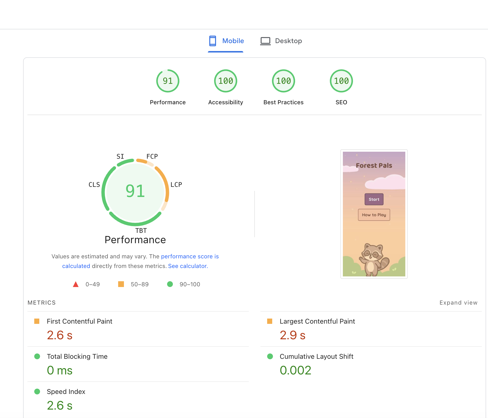

The mobile version also achieved strong scores:
- **Performance:** 95/100 - Fast loading on mobile devices
- **Accessibility:** 100/100 - Fully accessible across mobile platforms
- **Best Practices:** 100/100 - Maintains high standards on mobile
- **SEO:** 92/100 - Mobile-friendly and search engine optimized

**Performance Notes:**
- **First Contentful Paint (FCP):** Shows as orange/warning on mobile, indicating the time until the first content is rendered on screen. This is due to the custom background image and initial card assets loading.
- **Largest Contentful Paint (LCP):** Also shows as orange/warning on mobile, measuring when the largest content element (game board with cards) becomes visible. This is affected by the image-heavy nature of the memory card game.

Those performance are in an acceptable ranges for an image intensive game and do not significantly impact user experience. The overall performance scores remain very good.

**Summary:** Forest Pals demonstrates good performance across all devices, full accessibility compliance, and adherence to web development best practices. The game provides a smooth, responsive experience for players on both desktop and mobile platforms.

### Testing User Stories

This section demonstrates how each user story from the [Strategy](#strategy) section was successfully implemented and tested in the final game.

#### Parent User Stories

| User Story | Implementation |
|------------|----------------|
| As a **parent**, I want to find a safe educational game for my child, so that they can learn about animals in a fun and engaging way. | Game features 6 different forest animals (birds, deer, foxes, hedgehogs, rabbits, squirrels). No external links, ads, or inappropriate content. |

#### Player User Stories

| User Story | Implementation |
|------------|----------------|
| As a **player**, I want to see my name in the game, so that it feels special and personal to me. | Player name input form with validation. Name appears in raccoon's final speech bubble and end screen congratulations throughout gameplay session. |
| As a **player**, I want easy navigation and clear "How to Play" instructions, so that I can understand the game quickly without frustration. | Clear navigation with "Start", "How to Play", "Back" buttons. Instructions presented in numbered steps. Consistent back navigation from all screens. |
| As a **player**, I want to see a highscore leaderboard with my fastest times, so that I can challenge myself to improve and compete with family members. | Top 5 highscores displayed on end screen, sorted by fastest completion time. Latest score highlighted for easy identification. |
| As a **player**, I want my highscores to be saved, so that I can see my progress and try to beat my previous best times. | localStorage implementation persists top 5 scores across browser sessions. Scores survive page reloads and browser restarts until browser cache is manually cleared. |

#### User Stories

| User Story | Implementation |
|------------|----------------|
| As a **user**, I want the game to be responsive and touch-friendly, so that I can play comfortably on my phone, tablet or desktop. | Responsive grid layout adapts to all screen sizes (3x4 on mobile, 4x3 on tablet and desktop), touch-optimized controls, and optimized interface elements for seamless cross-device gameplay. |

**Summary:** All 6 user stories have been successfully implemented and thoroughly tested. The game meets all requirements defined in the Strategy phase, providing a safe, educational, and engaging experience for young children and their parents across all devices.

## Deployment

This project is hosted **on GitHub Pages**. Updates pushed to the main branch will automatically update the live site. **Please do not make changes directly to this repository**, since updates pushed to `main` will immediately update the live site. Use a fork or clone to make changes safely. Thank You!

1. Log into [my GitHub repository](https://carokyp.github.io/Forest-Pals/)
   
2. Click the "Settings" tab (top of the repository)
   

 

  

3. Click "Pages" from the left-hand side menu.
   

 

4. Under the source section, click the Branch dropdown, and switch the selection from ‘None’ to ‘Main’ and choose "/ (root)" folder
   

5. Click "Save"
   
6. Wait 1-2 minutes for deployment, the site will be live at [https://carokyp.github.io/Forest-Pals](https://carokyp.github.io/Forest-Pals)

### Clone this repository

Cloning creates a local copy on your computer linked to the original repository. Any changes you push will be sent to the original repository, which will require approval.

#### Windows

1. Go to [this repository](https://carokyp.github.io/Forest-Pals/) on GitHub
2. Click Code, select HTTPS, and copy the link.

   
3. Open Git Bash.
4. Change the current working directory to the location where you want the cloned directory.
5. Type `git clone`, and then paste the URL you copied earlier.
6. `git clone https://github.com/Carokyp/Forest-Pals.git`
7. Press Enter to create your local clone.

#### Mac

Follow the same steps as Windows, but use Terminal instead of Git Bash.

1. Open Terminal
2. Change the current working directory to the location where you want the cloned directory.
3. Type `git clone`, and then paste the URL you copied earlier.
4. `git clone https://github.com/Carokyp/Forest-Pals.git`
5. Press Enter to create your local clone.

### Run a copy of this repository via Fork

Forking creates a separate copy of the repository under your own GitHub account.
- You can make changes freely.
- If the original repository is updated, GitHub will notify you, and you can pull updates into your fork.

__Create a new fork__  

1. First, set up Git [Download and install Git on your computer](https://git-scm.com/downloads)
   
2. Go to [Forest-Pals](https://github.com/Carokyp/Forest-Pals) repository
   
3. Click the 'Fork' button on the upper right part of the page.
   
   

     
   

4. You now have a fork of the Forest-Pals repository in your GitHub account. Go to your profile, open the forked repository, and upload the required files.
   
5. Above the list of forked files, click the 'Code' button.

  

6. A drop-down menu will appear. Select the one which applies to your setup. Further details on completing the final step can be found on [GitHub Fork Documentation](https://docs.github.com/en/pull-requests/collaborating-with-pull-requests/working-with-forks/fork-a-repository).

**Making Changes and Pushing Updates**

1. Create a new branch for your change
   * `git checkout -b my-feature-branch`
2. Make your changes in your local repository.
3. Stage and commit your changes:
   * `git add .`
   * `git commit -m "Describe your changes here"`
4. Push your changes to your remote repository:
   * `git push origin my-feature-branch`

**Pull Request Fork**
1. Go to your fork on GitHub.
   
   

       
   

   
2. You’ll see a message: “Compare & pull request”. Click it.
   
   

   

   
3. Ensure the pull request is set to merge from your fork/branch → into the original repo/main (or another branch).
   
4. Add a clear title and description of what you changed.
   
   

       
   

   
5. Click Create Pull Request.

**Pull Request Cloned repo**
1. Open a Pull Request on GitHub (same as above).
2. **Important:** If you cloned and have write access, you can push directly and open a Pull Request. If you cloned but don’t have write access, you must fork first.

## Credits

I would like to thank my mentor, Brian, for the assistance and support he provided throughout this project.

### Code References

Some parts of the project required utility scripts and styling tweaks. I adapted solutions from the following resources, modifying them to fit the project’s needs.

